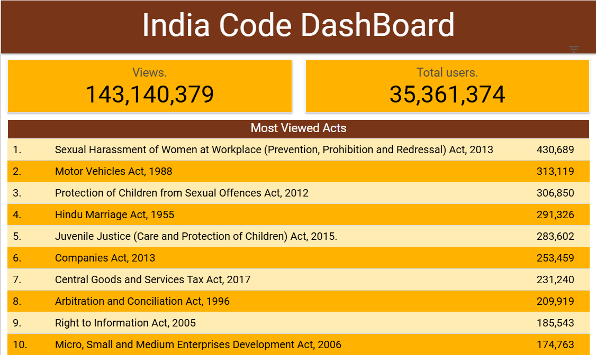
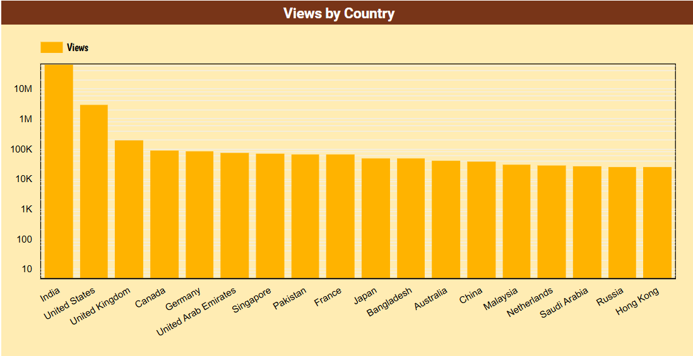

# LexRAG

LexRAG is a Retrieval-Augmented Generation (RAG) tool designed to provide legal aid, summarize laws, rights and gather key points from legal documents related to general Indian laws. It helps speed up the legal process by leveraging advanced AI and document retrieval techniques.

## Features
- Summarize legal documents
- Add citations and gather key points
- Retrieve crucial information from uploaded case files
- Uses Gemini LLM for answers
- Supports Hugging Face datasets for document ingestion

## Prerequisites
- Python 3.10+
- Docker (optional, for containerized deployment)
- Hugging Face account (for dataset access)
- Google API Key (for Gemini LLM)

## Setup Instructions

### 1. Clone the Repository
```sh
git clone https://github.com/ajverse/LexRAG.git
cd LexRAG
```

### 2. Hugging Face CLI Login (for dataset access)
If you need to access private datasets, log in using the Hugging Face CLI:
```sh
pip install --upgrade huggingface_hub
huggingface-cli login
```

### 3. Set Environment Variables
Create a `.env` file in the root directory with the following content:
```
GOOGLE_API_KEY=your_google_api_key_here
HF_DATASET_ID=ajverse/law-docs  # or your preferred dataset
```

### 4. Install Python Dependencies
```sh
pip install --upgrade pip
pip install -r requirement.txt
```

### 5. Run the Application (Locally)
```sh
uvicorn app.main:app --host 0.0.0.0 --port 7860
```

## Usage
- Access the app at `http://localhost:7860` after starting the server.
- Upload or query legal documents as needed.

## Notes
- Make sure your Google API key has access to Gemini models.
- The Hugging Face dataset should be public or you must be authenticated.

## Project Inspiration
A growing backlog of cases is plaguing the Indian Judicial System as a result of rising crime, litigation, and scarce resources. There are delays in justice, higher expenses, and stress on all parties due to this backlog. Verdict AI is a machine learning tool designed to forecast court case times, therefore streamlining and speeding up the legal process.

Judges' time can be better utilized concentrating on more complex matters by using Verdict AI to identify cases that are likely to be settled or dismissed early. Additionally, each verdict's specific confidences are calculated by the model, and this information can be utilized to forecast how long the verdict will take. Verdict AI helps make sure that crucial information is not overlooked and offers justifications for its judgments.



